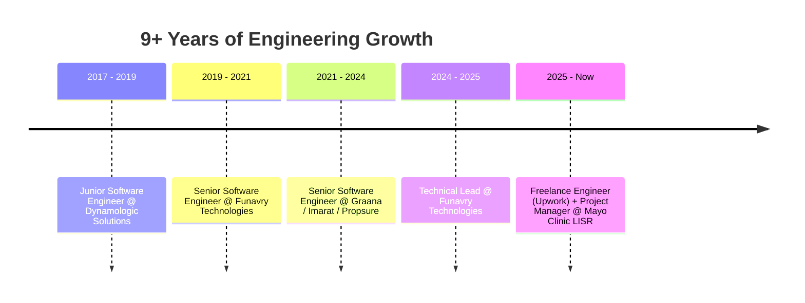

<!--
═══════════════════════════════════════════════════════════════════════════════
  ⚙️  IMPORTANT: Replace every "hamza-mehmood" below with your REAL GitHub username.
      (Use Find & Replace: hamza-mehmood  →  yourActualUsername)
      Also swap the social links (LinkedIn, email, Upwork) with your own.
═══════════════════════════════════════════════════════════════════════════════
-->

<!-- ======================= ANIMATED HEADER BANNER ======================= -->
<div align="center">


<!-- ======================= TYPING ANIMATION ======================= -->
<a href="https://github.com/hamza-mehmood">
  
</a>

<!-- ======================= TOP BADGES ======================= -->
<p>
  
  
  
  
</p>

</div>

---

## 👋 About Me

```typescript
const hamza = {
  role: "Project Manager & Senior Software Engineer",
  currentProject: "Living Evidence Systematic Review (LISR) @ Mayo Clinic",
  experience: "9+ years",
  location: "Pakistan 🇵🇰 (Remote-friendly)",
  expertise: ["React Native", "ReactJS / Next.js", "Blockchain", "AI Solutions"],
  currentFocus: "Leading teams, shipping products & continuous evidence synthesis",
  philosophy: "Self-motivated, analytical, and obsessed with clean architecture",
  funFact: "Shipped an SIP call-center app in 1.5 months after it stalled for a year 🚀",
};
```

I'm a **self-motivated, analytical software engineer turned Project Manager** with a strong foundation in **React Native** and a proven track record of delivering **high-quality mobile and web applications** for international clients. Over the last 9 years I've grown from Junior Engineer → Senior Engineer → Technical Lead → **Project Manager**, working across **real estate, fintech, blockchain, healthcare, and AI**.

---

## 🔬 Current Focus

> **🏥 Project Manager — Mayo Clinic (LISR)**
> Leading the **Living Interactive Systematic Evidence Review** platform — an internal Mayo Clinic lab project that streamlines **continuous evidence synthesis for clinical decision-making**. The system supports modules for **study import, screening, data extraction, and quality assessment**, integrates **R-based tables & meta-analysis tools** for robust statistical evaluation, and powers **guideline development** plus a public website for transparent dissemination of findings.

<div align="center">

</div>

---

## 🧰 Tech Stack

### 📱 Mobile


### 🌐 Web & Frontend


### 🧠 Languages


### 🗂️ State & Data


### ⛓️ Blockchain & AI


### ☁️ Cloud, DevOps & Services


### 💳 Payments & Maps


### 🛒 CMS & E-commerce


---

## 💼 Experience Journey



| Role | Company | Period |
|------|---------|--------|
| 🧭 **Project Manager** | Mayo Clinic — LISR (Living Evidence SR) | Present |
| 💻 **Freelance Software Engineer** | Upwork (Remote) | 08/2025 – Present |
| 🚀 **Technical Lead** | Funavry Technologies | 02/2024 – 08/2025 |
| 🏠 **Senior Software Engineer** | Graana / Imarat / Propsure | 03/2021 – 02/2024 |
| 📲 **Senior Software Engineer** | Funavry Technologies | 06/2019 – 03/2021 |
| 🌱 **Junior Software Engineer** | Dynamologic Solutions | 06/2017 – 06/2019 |

🎓 **B.S. Computer Science** — PMAS-UAAR, Rawalpindi (2017)

---

## 🏗️ Featured Projects

| Project | Description | Domain |
|---------|-------------|--------|
| 🏥 **Mayo Clinic — LISR** | Living interactive systematic evidence review platform for clinical decision-making — study import, screening, extraction, R-based meta-analysis & guideline development. | Healthcare / Research |
| ⛓️ **ChainGPT** | Crypto wallet + AI Chatbot DAO, AI NFT Generator & Staking modules for an AI model that runs on blockchain. | Blockchain / AI |
| 🏘️ **Graana Xperience** | Rebuilt Graana's flagship real-estate app from scratch with latest RN practices for long-term version stability. | Real Estate |
| 🛵 **Graana Rider** | Rider app with new UI, sticky-header scroll fix, Firebase push & App Center build pipeline. | Real Estate |
| ☎️ **ARMS Call Center** | SIP-integrated call center app shipped in a record **1.5 months** with full send/receive call support. | Telephony |
| 🗺️ **Propsure** | Property-data system across Islamabad, Lahore, Multan & Karachi with exact location lookup. | PropTech |
| 🌟 **TIG (The Influence Group)** | Marketplace to discover and hire top global influencers directly from mobile. | Marketplace |
| 🎓 **EduOpenings** | Job platform for the education field — jobs, professional development & freelance work. | EdTech |
| 🚗 **Salis** | Car & helicopter rental app for Dubai with multiple vehicle categories. | Mobility |
| 🔧 **Zoha** | Marketplace for old/new car & auto spare parts with owner chat & inventory management. | E-commerce |
| 🎣 **Lake Wakes** | Lake navigation app surfacing nearby spots & best fishing routes. | Lifestyle |
| 🏎️ **Auto Advisor** | Online marketplace connecting automotive buyers & sellers in Pakistan. | Marketplace |

---

## 📊 GitHub Analytics

<div align="center">


<br/>


<br/>


</div>

---

## 📈 Contribution Graph

<div align="center">

</div>

<!-- ======================= SNAKE ANIMATION ======================= -->
<!--
  ⚠️ The snake below requires a GitHub Action to generate.
  Create .github/workflows/snake.yml (see the snippet I gave you in chat)
  and replace "hamza-mehmood" in the URLs after the first run.
-->
<div align="center">

</div>

---

## 🤝 Let's Connect

<div align="center">

[](https://linkedin.com/in/your-linkedin)
[](https://upwork.com/freelancers/your-profile)
[](mailto:your.email@example.com)
[](https://github.com/hamza-mehmood)

</div>

<div align="center">

### 💬 *"Turning complex problems into clean, shippable solutions."*


</div>

<!---
hamzakayani/hamzakayani is a ✨ special ✨ repository because its `README.md` (this file) appears on your GitHub profile.
You can click the Preview link to take a look at your changes.
--->
